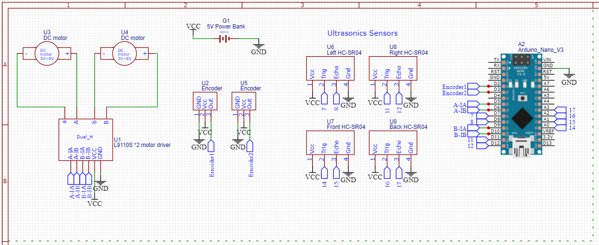

# Zoef for Raspberry Pi
This page is about the robot Zoef, developed at TU Delft (the Netherlands). Here you will find instructions to set-up a Raspberry Pi to control your robot.

## Contents
1. [Getting Started](#Getting-Started)
2. [Extra Material](#Extra-Material)
3. [FAQ](#FAQ)
4. [Robot_API Reference](#Robot_API-Reference)

## Getting Started
In this project, you will be using a robot, called Zoef, designed at TU Delft. This repository refers to the Zoef version designed for Raspberry Pi and Arduino Nano. The Raspberry Pi runs Ubuntu and ROS Melodic to control the robot. The Arduino runs Telemetrix to communicate with the Raspberry Pi and works as a slave-board, executing commands received from the Raspberry Pi. With this configuration, the code to control the robot can be written in Python and run fully in the Raspberry Pi. The Robot_API provides methods to control motor speeds, read sensors etc.

The following sections will guide you through the installation and configuration process. A simple example program is also given to test if everything is working. Finally, a reference for the Robot_API is provided.

### Installing the Zoef Image in the Raspberry Pi
To install the Zoef interface you will need to:

1. **Download** the image file `zoef_RASPBERRY.zip` on your computer from the following [link](https://surfdrive.surf.nl/files/index.php/s/fXCFNj4U762kTT6).
2. **Flash** the image onto an SD card using [Etcher](https://www.balena.io/etcher/). (Note: ignore failure error after validation)
3. **Insert** the newly flashed SD card into the Raspberry Pi and **power it on**. Wait a couple of minutes for the RPi to boot up.

### Connecting to the Raspberry Pi
To connect the Raspberry Pi to your computer you can use SSH (via PuTTY or PowerShell on Windows 10) using the IP address of the Raspberry Pi with username: **`zoef`** and password: **`zoef_zoef`**. When you first boot, the board won’t be connected to your network so you have 3 possibilities:

- Connect to the **Zoef WiFi**: After booting up, the board will create a WiFi network called Zoef_”XXXXX” with password: zoef_zoef. When connected to that network, you can SSH using the IP address - `zoef@192.168.42.1`. This will allow you to control the Raspberry Pi from your computer. For that, open a terminal (or PowerShell window) and type:

`ssh zoef@192.168.42.1`

In the first connection you will see the warning message "The authenticity of host '192.168.42.1 (192.168.42.1)' can't be established.". This is not a problem: you can continue to connect. You will be asked to provide a password, which is the same one you used to connect to the Zoef WiFi: `zoef_zoef`. If this is the first time you are connecting to the Zoef Raspberry Pi, you will need to define a new password for it. First, confirm the old password (`zoef_zoef`), then define a new one of your choice.
> Note: When connected to the *Zoef WiFi*, you won’t have access to the internet.

- **Wired connection**: Use a network cable to connect the Raspberry Pi to your local network (via your router or directly to your computer) and SSH into the IP address assigned to your board.
> Note: To find out the assigned IP address to your board, you have several options: Check the control panel of your router for connected clients, scan your network via zenmap/nmap, or use the mobile app called Fing. Alternatively, use the command ip address on your Raspberry which will require an extra HDMI monitor.

- **Wireless connection**: It is possible to configure the Raspberry Pi to connect to your WiFi via the web interface of Zoef. To do that, while being connected to the Zoef_”XXXXX” network, open your browser and type in the IP address of the board: 192.168.42.1
The interface is in Dutch, but that should not be a problem. Navigate to the “Netwerk” section and fill in your Wi-Fi credentials. Click the green button. The board will then restart and connect to your Wi-Fi. Connect your computer back to your own WiFi network and wait a couple of minutes for the Zoef Raspberry Pi to boot-up and connect to your WiFi. Then, open a terminal and run `ssh zoef@192.168.42.1` to connect to the Zoef Raspberry Pi via WiFi.

## Necessary fixes
The fixes below are necessary to solve a few issues and for the Zoef board to have internet access.

> *Some of the following steps require Internet access, so make sure to connect your board to your network via Ethernet or Wi-Fi, as described above.*

- To solve the issue "Unable to resolve host", open a Zoef terminal and run the following commands:
```
# Display the ID of your Zoef board:
cat /etc/hostname
# Open the file hosts:
sudo nano /etc/hosts
# Append the following lines in the file:
127.0.0.1     localhost
127.0.0.1     zoef
127.0.1.1     Zoef_XXXXXX (Substitute XXXXXX for the ID of your robot)
```
Save the file (Ctrl + S) and exit (Ctrl + X).

- To solve the issue "Temporary failure in name resolution", run the commands in a Zoef terminal. They will provide the Zoef board with a script file that will be executed every time the board boots-up.
> Note: Access to the internet is necessary.
```
# Fix internet access issue:
echo "nameserver 8.8.8.8" | sudo tee -a /etc/resolv.conf
sudo systemctl restart systemd-resolved.service

# Download shell script which can call the same commands automatically:
cd ~
wget -L https://raw.githubusercontent.com/Silverlined/Robotics-Semester-4/master/systemd_services/fix_resolv.sh

# Make it executable:
sudo chmod +x fix_resolv.sh

# Create a systemd service to call the script after reboot:
cd /etc/systemd/system/
sudo wget -L https://raw.githubusercontent.com/Silverlined/Robotics-Semester-4/master/systemd_services/fix_resolv.service
sudo systemctl start fix_resolv.service
sudo systemctl enable fix_resolv.service
```

- To solve the issue "Unable to retrieve data from Ultrasonic sensor", execute the commands below in a Zoef terminal:
> During setup of the ultrasonic sensors, you will come across a runtime exception. The predefined GetDistance message in zoef\_msgs expects to receive data of type int32, however, Range from sensor_msgs (which is used in the ROS\_telemetrix\_api) returns data of type float32. That is why you have to change the data type of GetDistance.srv in zoef\_msgs to float32 and re-build the ROS workspace (re-build is necessary because we are editing ROS messages).
```
cd ~/zoef_ws/src/zoef_msgs/srv/
sudo nano GetDistance.srv

# Change int32 to float32, save (CTRL+S) & exit (CTRL+X)
---
float32 data
```

Move the old build files away from the Zoef workspace. You could also remove them completely, but for now just move them in case we need to backup:
```
cd ~/zoef_ws/
mv build/ ..
mv devel/ ..
```

Build the workspace:
```
catkin_make
```
> **Repeat the command `catkin_make` several times**, until the process reaches 100%. For some reason, building runs into errors which are resolved when re-initiated.

### Uploading Telemetrix to the Arduino
Telemetrix4Arduino is used to collect data from the microcontroller and transmit it to the Raspberry. In this way, the microcontroller can be controlled remotely. Once you have installed the Zoef image, you will have all the files needed for the robot to work at `~/zoef_ws/src/zoef_ros_package`.
In order to control the Arduino via ROS, the Telemetrix4Arduino code first needs to be uploaded to the microcontroller. For that, first connect the Arduino Nano to one of the USB ports of the Zoef Raspberry Pi. Then, run the commands below in a Zoef terminal (or a terminal window that is connected to the Zoef Raspberry Pi via SSH). Depending on the version of your Arduino Nano you will have to run the `nano` or `nano_old` commands. If you are not sure, try one of them first. If you get an error while executing the upload, try to compile and upload using the other commands.

For the Arduino Nano with old bootloader, execute:
```
cd /usr/local/src/zoef/zoef_arduino
./run.sh build_nano_old Telemetrix4Arduino
./run.sh upload_nano_old Telemetrix4Arduino
```

For the Arduino Nano with new bootloader, execute:
```
cd /usr/local/src/zoef/zoef_arduino
./run.sh build_nano Telemetrix4Arduino
./run.sh upload_nano Telemetrix4Arduino
```
> *run.sh is a bash script which makes use of arduino-cli to compile and upload the Telemetrix4Arduino sketch to an Arduino Nano.*

### Configuring sensor & actuator connections
In order to control the Arduino via ROS it is also needed to specify how the robot hardware is connected to the microcontroller:
```
cd /usr/local/src/zoef/zoef_ros_package/config
# Remove old file
rm zoef_nano_config.yaml
# Download new version
wget -L https://raw.githubusercontent.com/Silverlined/Robotics-Semester-4/master/ros_workspace/config/zoef_nano_config_L9110.yaml
```
Note: This file gives information to ROS about the pinout to different sensors and actuators. The new file considers the connections shown in the figure below.



### Setting up ROS communication

1. Replace `hw_control.launch` file:
```
cd /usr/local/src/zoef/zoef_ros_package/launch
rm hw_control.launch
wget -L https://raw.githubusercontent.com/Silverlined/Robotics-Semester-4/master/ros_workspace/launch/hw_control.launch
```
> Note: This is a ROS configuration file that initiates a parameter server and starts all ROS nodes. It also tells ROS to get information from the zoef_nano_config_L9110.yaml

2. Replace `ROS_telemetrix_api.py` file:
```
cd /usr/local/src/zoef/zoef_ros_package/scripts
rm ROS_telemetrix_api.py
wget -L https://raw.githubusercontent.com/Silverlined/Robotics-Semester-4/master/ros_workspace/scripts/ROS_telemetrix_api.py
sudo chmod +x ROS_telemetrix_api.py
```
> Note: This file establishes a connection between the different ROS nodes and Telemtrix4Arduino. It is the core file that specifies the inner workings of the system and initiates control over the microcontroller.

3. Install missing libraries:
```
python3.8 -m pip install bitstring
```

### Controlling the Robot
Once you have set up everything, there are several ways to control and test your robot. The first thing to try is to control the LED of the Arduino through one of the predefined ROS services:

To initiate ROS we can use the launch file. Open a new terminal, execute the launch file and keep it running.

1. Initiate ROS (from the new SSH session):
```
roscd zoef_ros_package/launch
roslaunch hw_control.launch
```

2. Turn ON the LED (from the old SSH session):
```
rosservice call /zoef/set_pin_value "{pin: '13', type: 'digital', value: 1}"
```

3. Turn OFF the LED (from the old SSH session):
```
rosservice call /zoef/set_pin_value "{pin: '13', type: 'digital', value: 0}"
```
> If this works, then you can move on to controlling the robot with Python.

4. Download Robot_API.py file:
```
mkdir /home/zoef/python_controllers
cd /home/zoef/python_controllers
wget -L https://raw.githubusercontent.com/Silverlined/Robotics-Semester-4/master/Robot_API.py
```

5. Write your own Python program:
Once you have the `Robot_API.py` file, you can import it and use it in any of your new scripts. A simple example is provided below:

```
#!/usr/bin/env python3.8
import Robot_API

robot = Robot_API.createRobot()

while True:    
   print(robot.getEncoder("left"))
   print(robot.getEncoder("right"))
   robot.setMotorSpeed("left", 100)
   robot.setMotorSpeed("right", 100)
...
```
To run this code, create a file called `my_program.py` and copy the code to it. For that, open a Zoef terminal and execute the commands:

```
# Navigate to the scripts folder:
cd /home/zoef/python_controllers
# Create an empty file and open it:
touch my_program.py
nano my_program.py
# Paste the program into the file, save it (CTRL+S) and exit (CTRL+X)
```
To  execute your program, run the following command in a terminal:
```
python3.8 my_program.py
```
> **Note: when you run your program, make sure that `hw_control.launch` is running in another Zoef terminal. Otherwise, the Robot_API will fail to run ROS commands and you will get an error.**
To execute the `hw_control.launch`, run the following in a separate terminal:
```
roscd zoef_ros_package/launch
roslaunch hw_control.launch
```
So, you will always have at least 2 terminal windows: one running `hw_control.launch` and another running your code.

## Extra Material
Some material that you might find useful:
[Control of Mobile Robots](https://youtube.com/playlist?list=PLp8ijpvp8iCvFDYdcXqqYU5Ibl_aOqwjr)


## FAQ
**Question:** Are there enough digital pins on the Arduino Nano?

**Answer:** The Arduino Nano dev board has 12 digital I/O pins denoted with D2~D13 (6 of which are PWM capable). There are also 8 analog pins (6 of which can be used as digital I/O). So, in the end, you actually have 18 digital pins available.

## Robot_API Reference
Robot_API is a Python interface class that provides access to all robot functionalities. You can use it to control the speed of the motors, read the sensors, or access other I/O pins. You should **not** modify the `Robot_API.py` file. Instead, in your program you can add `import Robot_API` to have access to its functions.

Below you find an explanation of the methods provided.

### Methods:

    createRobot()
        Description
        ----------
        Creates an instance of the robot class.

        Usage
        ----------
            my_robot = Robot_API.createRobot()
</t>

    getTimestamp()
        Description
        ----------
        Returns the elapsed time in seconds since initialization of the Robot.
        Fractions of a second may be present if the system clock provides them.

        Usage
        ----------
            elapsed_time = my_robot.getTimestamp()
</t>

    getDistance(sensor)
        Description
        ----------
        Returns the calculated distance in centimeters for the given ultrasound sensor.

        Parameters
        ----------
        sensor : str
            The name of the ultrasound sensor as defined in the config .yaml file.

        Usage
        ----------
            distance = my_robot.getDistance("front")
</t>

    getEncoder(sensor)
        Description
        ----------
        Returns data from an encoder: every encoder pulse increments the counter

        Parameters
        ----------
        sensor : str
            The name of the encoder as defined in the config .yaml file

        Usage
        ----------
            encoder_reading = my_robot.getEncoder("left")
</t>

    getAnalogPinValue(pin)
        Description
        ----------
        Returns data from an analog pin

        Parameters
        ----------
        pin : int
            The analog pin number as an integer
            A0 -> 14
            A1 -> 15
            ...
            A7 -> 21

        Usage
        ----------
            A0_pin_value = my_robot.getAnalogPinValue(14)
</t>

    setAnalogPinValue(pin, value)
        Description
        ----------
        Sets the output PWM signal of a pin and returns 'True' if successful

        Parameters
        ----------
        pin : int
            This should be a PWM capable pin
            Select from pin numbers: 3, 5, 6, 9, 10, or 11
        value : int
            The value can be a number from 0-255

        Usage
        ----------
            status = my_robot.setAnalogPinValue(3, 127)
            print(status)
</t>

    getDigitalPinValue(pin)
        Description
        ----------
        Returns state of a digital pin.

        Parameters
        ----------
        pin : int
            The digital pin number as an integer
            (Hint: Follow the pinout diagram of the microcontroller)
            D2 -> 2
            D3 -> 3
            ...
            D12 -> 12
            ...
            A5 -> 19

        Usage
        ----------
            A4_pin_value = my_robot.getDigitalPinValue(18)
</t>

    setDigitalPinValue(pin, value)
        Description
        ----------
        Sets the output state of a digital pin and returns 'True' if successful

        Parameters
        ----------
        pin : int
            This can be any pin from 0 to 19, excluding 20 (A6) and 21 (A7).
        value : int
            The value can be either 0 or 1

        Usage
        ----------
            status = my_robot.setDigitalPinValue(18, 1)
            print(status)
</t>

    setLED(value)
        Description
        ----------
        Sets the output PWM signal of the LED and returns 'True' if successful.
        The LED pin is predifined in the config .yaml file.

        Parameters
        ----------
        value : int
            The value can be a number from 0-255

        Usage
        ----------
            status = my_robot.setLED(255)
            print(status)
</t>

    setServoAngle(angle)
        Description
        ----------
        Sets the angle of the servo motor and returns 'True' if successful.
        The servo pins are predifined in the config .yaml file.

        Parameters
        ----------
        angle : int
            The value can be a number from 0-360

        Usage
        ----------
            status = my_robot.setServoAngle(180)
            print(status)
</t>

    setMotorSpeed(motor, value)
        Description
        ----------
        Sets the speed of a motor and returns 'True' if successful.
        The servo pins are predifined in the config .yaml file.

        Parameters
        ----------
        motor : str
            The name of the motor as defined in the config .yaml file
        value: int
            The value can be any number between 0 - 100
            0 - Stop
            100 - Max. Speed

        Usage
        ----------
            status = my_robot.setMotorSpeed("left", 100)
            print(status)
</t>

    stop()
        Description
        ----------
        Stops both motors.

        Usage
        ----------
            my_robot.stop()
